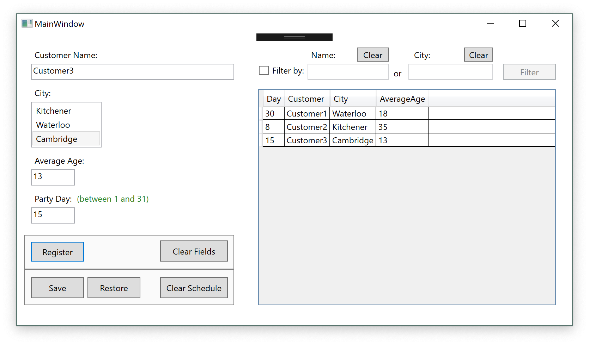

# C# Assignments

This assignments were developed for class assignments and they date from July 2018. They are far from great software, but what makes me proud of them is that they are a Milestone when I was resuming my career with a post-grad at the Conestoga College.

With the Software Development Techniques class I've reviewed so many important topics for software development, such as:

* Data types
* Data structures
* Control Flow
* Object Orientation

And I've learnt some modern concepts as indicated in each assignment description.

## Assignment #5: Generic Schedule

Specific concepts exercised in this assignment:

* GUI design in Visual Studio
* Data binding
* Error/Exception Handling
* Saving files in binary format and XML (with and withou serialization)
* LINQ

Assignment requirements:

    1. Create a one-window (one-page) application, which will have two distinct capabilities (placed in the separate areas of the screen):
       * Create a record to be placed in the scheduler
       * Display newly created record in the data grid
    2. After you finish entering data, save data to XML file on the disk
    3. Create a capability (button) in the application, which will load the data from the disk to
    the data grid
    4. Using LINQ create filtering capability in the application, allowing filtering data using
    any field of your choice
    5. Add error handling to the application which will display the input error if it occurs
    6. Add converter to your application, showing the items placed in the grid in red when they are large enough

Here are some screenshots of the app running:

