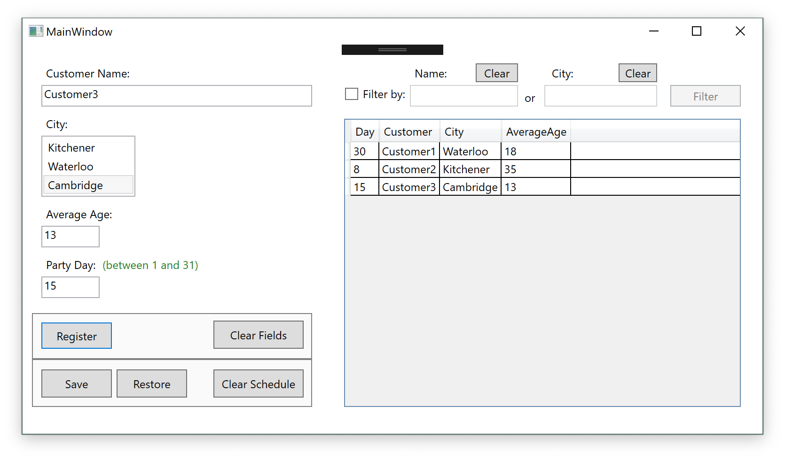
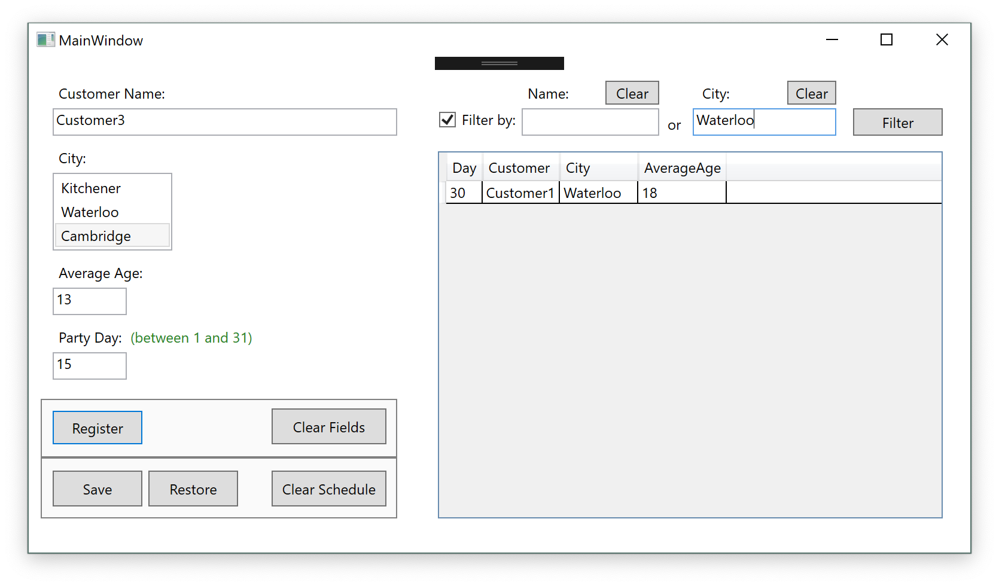

# Assignment #5: Generic Schedule

Specific concepts exercised in this assignment:

* GUI design in Visual Studio
* Data binding
* Error/Exception Handling
* Saving files in binary format and XML (with and without serialization)
* LINQ

Assignment requirements:

1. Create a one-window (one-page) application, which will have two distinct capabilities (placed in the separate areas of the screen):
   * Create a record to be placed in the scheduler
   * Display newly created record in the data grid
2. After you finish entering data, save data to XML file on the disk
3. Create a capability (button) in the application, which will load the data from the disk to the data grid
4. Using LINQ create filtering capability in the application, allowing filtering data using any field of your choice
5. Add error handling to the application which will display the input error if it occurs
6. Add converter to your application, showing the items placed in the grid in red when they are large enough

Here are a couple of screenshots of the app running:

